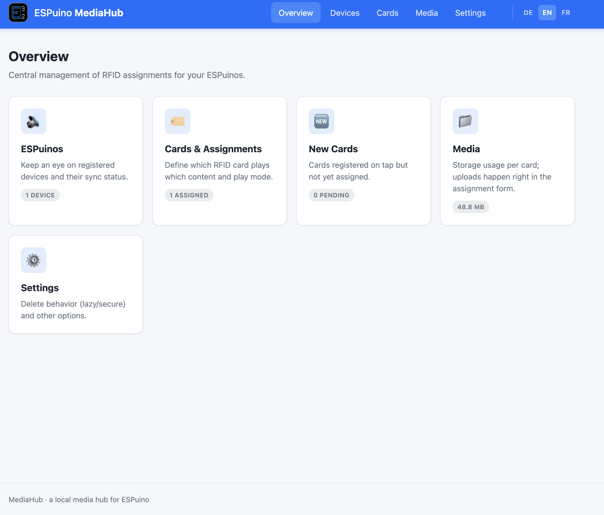

# ESPuino MediaHub

Lightweight, **locally** run hub for centrally managing the RFID
assignments of multiple [ESPuinos](https://github.com/biologist79/ESPuino). Concept & details: [docs/mediahub-konzept.md](docs/mediahub-konzept.md).

## A picture first



## Quick start

The container runs (per default) as `www-data` (uid/gid `33:33`) rather than root, so
`./data` (the only thing it writes to) needs to be writable by that user
first. Point `./media` at wherever your existing audio library already
lives — it's mounted read-only and MediaHub never writes to it. If you want
to make any changes: don't edit docker-compose.yml directly - use .env instead.

```bash
cp env-example .env
mkdir -p data
chown -R 33:33 data
docker compose up -d --build
```

By default MediaHub looks for a local `./media` folder; set `MEDIAHUB_MEDIA` in
`.env` to point at your actual library instead, e.g. `MEDIAHUB_MEDIA=/mnt/audiobooks`.

**Directory listing and file reading are separate Unix permissions** — a
track can show up in the browser tree yet fail to save with "permission
denied" if the file itself isn't readable by uid `33`. If that happens,
either `chmod -R o+rX /path/to/your/library` or set `MEDIAHUB_UID`/`MEDIAHUB_GID`
in `.env` to the uid/gid that already owns your library (`id -u` / `id -g`).

Then open [http://localhost:8080](http://localhost:8080).
Hint: Adjust localhost and port according to your needs.

For local development without Docker:

```bash
pip install -r requirements.txt
python app.py        # http://localhost:8080
```

## Updating

```bash
git pull
docker compose up -d --build
```

`git pull` stays conflict-free because your settings live in `.env` (which git
ignores), not in the tracked files. `--build` is required — without it Compose
reuses the existing image and keeps running the previous version.

## Stack

- **Python 3.12 + Flask** (served by Gunicorn in the container), image based on `python:3.12-slim`.
- **Framework-free frontend** — hand-written CSS in the ESPuino look (blue top bar, logo). Works offline, no CDN dependencies.
- Two volumes: `./data` (devices/cards/assignments in a single `db.json`, read-write) and `./media` (your own existing audio library, mounted read-only — MediaHub only browses and references it, it never copies or uploads files).
- Runs as non-root (`33:33` / `www-data`) by default; see [Quick start](#quick-start).
- **Multilingual** (DE/EN/FR) via Flask-Babel; language switcher top right, auto-detected via `Accept-Language`.
- **Optional password** for the web UI (Settings page) — the ESPuino-facing API stays open regardless, since devices can't log in.

## Feature overview

- **Devices** (`/devices`): ESPuinos that have contacted the hub (IP, last seen, last card).
- **Cards & Assignments** (`/cards`): overview, assign/edit — pick files/folders from the mounted library via an inline tree browser (`static/js/media-browser.js`, modeled after the ESPuino web UI's own SD explorer) or set a webradio stream URL — force refresh (per card/all), delete.
- **One card on several ESPuinos**: the assignment form lists the other known devices as tick boxes and writes the same content to each ticked one as its own independent assignment (own play position, own cache). Devices that already carry the card are pre-ticked so an edit doesn't let siblings drift apart. Unticking never deletes — that stays the explicit Delete button, because a delete may call `DELETE /rfid` on the device.
- **New Cards**: filter at `/cards?pending=1` — cards registered on tap but not yet assigned (see concept §5.3). The card list and the dashboard refresh themselves: `static/js/live-cards.js` polls `GET /cards/state` every five seconds and reloads when the hub's card set changed, so a card tapped on an ESPuino appears without pressing F5. Polling rather than a server push is deliberate — Gunicorn runs two sync workers, and a held-open SSE stream per browser tab would starve the ESPuino-facing API. While a card ID is being typed or the duplicate dialog is open, a small banner offers the refresh instead of yanking the page away.
- **Media** (`/media`): storage usage per card; `/media/browse?path=` is the JSON API backing the tree browser.
- **Settings** (`/settings`): delete behavior lazy vs. secure (concept §13.1) — secure calls `DELETE /rfid` on the ESPuino and only removes the hub entry after a confirmed 200 response. Recursion depth for "use folder". Which devices an assignment pre-selects (only the one being edited, or all known ESPuinos) — a pre-selection only, never what gets written. Also: set/remove the optional hub password.
- **MediaHub API**: `GET /<espId>/card/<cardId>/manifest.json` (manifest, or `pending` registration), `GET /media/<path>` (media files, path relative to the library root).

## Maintaining translations

The source language for `_()`/`ngettext()` strings is English; German and French are catalog translations under `translations/<lang>/LC_MESSAGES/messages.po`. After text changes:

```bash
pybabel extract -F babel.cfg -o messages.pot .
pybabel update -i messages.pot -d translations   # update existing .po files
# fill in msgstr in translations/de/... and translations/fr/...
pybabel compile -d translations                  # only needed for local testing without Docker
```

The `.mo` files are compiled automatically at Docker build time (see Dockerfile) and are not committed.

## Contributing

Pull requests are welcome from anyone, and nothing needs to be enabled for that. One thing does trip
people up: the branch cannot live in this repository, since only collaborators may push here —
trying it fails with `Validation failed: must be a collaborator`. Work in a fork and the message
goes away.

If your change touches any `_()` / `ngettext()` string, please update the catalogs as well
(see [Maintaining translations](#maintaining-translations)).

## Status

Functional hub with device/card management, per-card manifests
(`version` = SHA-256, including the force-refresh lever), a library file/folder
browser for assignment (no uploads — files stay in place under `./media`),
`pending` registration, lazy/secure delete, assignments that cover several
ESPuinos in one save, a self-refreshing card list, and an optional web UI
password.

The ESPuino side is implemented and shipped with the firmware since version
3.1: `MEDIAHUB` play mode, `MediaHub_HandleCardTapped()` in `src/MediaHub.cpp`,
manifest download with LED progress, and — optionally — adoption of unknown
cards straight from a hub, without teaching them on the device first. The
user-facing side is documented in chapters 8 and 11 of the ESPuino handbook.
